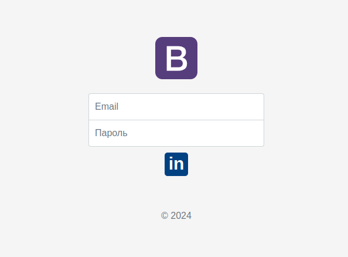
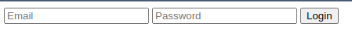

# PHP-oAuth2-MongoDB
## Pet-проект для демонстрации связки php + oAuth2 + mongoDb без использования библиотек реализующих oAuth2 под капотом

[](https://piratecode.ru)

# Описание
Проект создан в демонстрационных целях для показа как работает oAuth2 в связке с php и базой даных mongoDb. Большинство репозиториев показывают эту работу с использованием сторонних библиотек, которые под капотом реализуют oAuth2. В данном проекте авторизацию через этот протокол предоставляет выдуманный сервис PinkedIn.


# Иерархия
Папка `server` представляет собой удаленный хост поставщика oAuth2. Он никак не связан с клиентом. `server` только принимает запросы от клиента из папки `client`

Папка `client` это тот, кто хочет реализовать у себя авторизацию через oAuth2.

Думайте об этих папках как о двух разных, не связанных вместе компьютерах отдаленных друг от друга.

# Установка
Скопируйте env.example в файл .env в папке server и client
```bash
cd server
cp env.example .env
cd ../
cd client
cp env.example .env
```
Заполните данные внутри файла .env в двух папках. Некоторые данные уже предустановлены. Вы можете их изменить 
`CLIENT_ID` и `CLIENT_SECRET` будут доступны чуть позже.

Сбилдите докер
```bash
cd server
docker-compose up --build
```
Мы пропускаем часть, где пользователь заходит PinkedIn, регистрируется, создает приложение, получает данные для запросов.
Вместо этого в адресной строке браузера перейдите по адресу [http://localhost:8000/create_collections.php](http://localhost:8000/create_collections.php)
Вам будет показано, что создан пользователь с и данные `client_id` и `client_server`
```
Новый id клиента '667d8ab50ed5a4d40305cff4' Пользователь успешно зарегистрирован! '667d8ab50ed5a4d40305cff5' client_id: 936c9b6f9144fb4845a89e7e179d699d client_secret: 75c6a66819ad1a8a09056123e2483ff0
```
Скопируйте `client_id` и `client_server` в `client/.env`
```
# client_id выданный удаленным сервера
CLIENT_ID={Скопированное значение}
# client_secret выданный удаленным сервера
CLIENT_SECRET={Скопированное значение}
```

# Запуск сервера
Для запуска сервера авторизации oAuth2 запустите докер
```bash
docker-compose up
```
Для запуска клиентского сервера запустите сервер вручную
```bash
cd client
php -S localhost:3000
```
или воспользуйтесь скриптом
```bash
cd client
chmod + x start_server.sh
./start_server_sh
```
Перейдите по адресу [http://localhost:3000](http://localhost:3000) и нажмите на кнопку `in`
Введите данные пользователя указанные в `server/.env`

